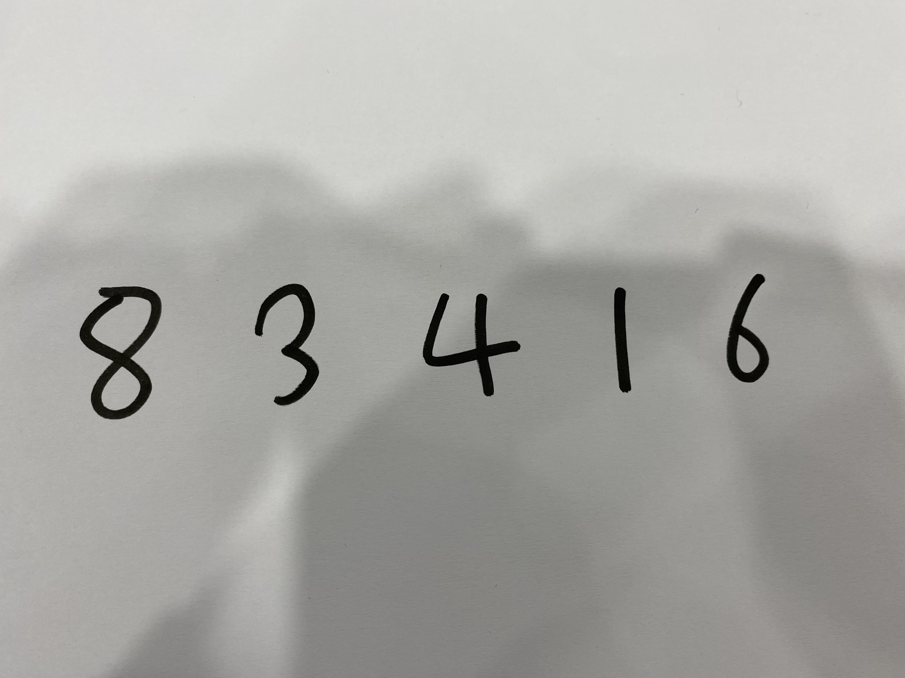
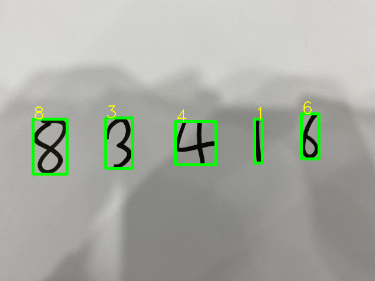

# Detection without Deep Learning
This is a digits detection sample code <ins> without deep learning </ins> written in Python that can be used to detect and classify custom handwritten digits .

# Usage:
```shell script
python infer.py --image_path sample_image/demo.jpg
```


# Example Image:


# Output:

